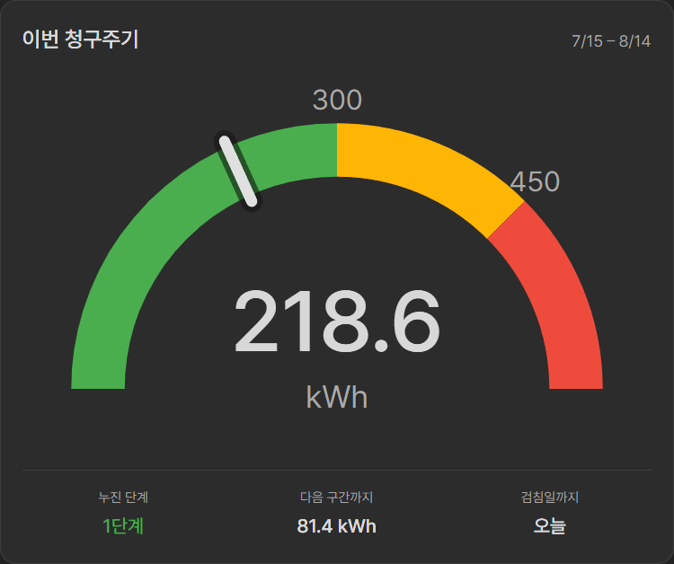
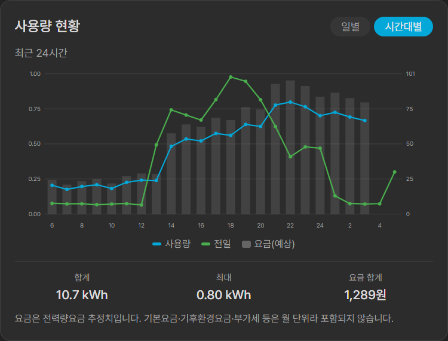
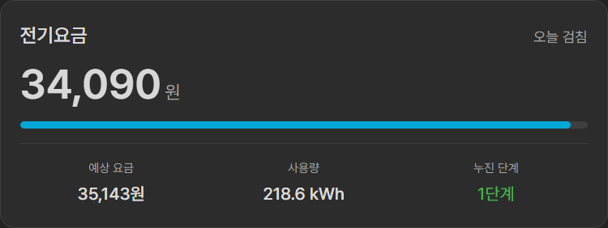

# KEPCO 스마트미터 for Home Assistant

[](https://hacs.xyz/)
[](https://www.home-assistant.io/)
[](https://github.com/jaein4722/ha-kepco-smart-meter/actions/workflows/validate.yml)
[](LICENSE)

한국전력공사 [파워플래너](https://pp.kepco.co.kr/)의 원격검침(AMI) 데이터로 **실제 전력량계를 Home Assistant에 붙인 것처럼** 동작하는 커스텀 통합입니다.

단순한 스크래퍼가 아닙니다. 계량기 지침과 시간별 소비를 구분해 다루고, **시간별 사용량을 실제로 전기를 쓴 시각에 기록**합니다.

<!-- images/dashboard-hacs.png 을 넣은 뒤 아래 주석을 푸세요

-->

## 왜 다른가

파워플래너는 20~21시 사용량을 22시가 넘어서 공개하기도 합니다. 조회 시점에 센서를 갱신하는 방식이면 히스토리가 두 시간 밀려 기록됩니다.

이 통합은 Home Assistant의 **장기 통계 API**에 구간 시작 시각으로 직접 써넣습니다.

```
데이터의 시각 = 전기를 실제로 쓴 구간의 시각   (API가 응답한 시각이 아님)
```

덕분에 **처음 설치하는 순간 지난 청구주기 전체가 에너지 대시보드에 채워집니다.** Home Assistant가 며칠 꺼져 있었어도 다음 실행에서 빈 구간을 메웁니다.

<!-- images/energy-dashboard.png 을 넣은 뒤 아래 주석을 푸세요

-->

## 특징

- **계량기 지침 재구성** — 전월지침을 한 번 입력하면 이후 사용량을 더해 실제 계량기와 같은 숫자를 만듭니다
- **타임스탬프 정확한 통계** — 실제 소비 시각에 기록, 늦게 도착하거나 정정된 값도 덮어씁니다
- **롤링 백필** — 매 갱신마다 최근 3일을 다시 훑어 지연·정정을 반영합니다
- **한전 계산값 그대로** — 요금과 누진 단계를 재구현하지 않고 한전이 준 값을 씁니다
- **전용 카드 포함** — 누진 구간을 계절에 맞춰 그리는 Lovelace 카드가 함께 설치됩니다
- **브라우저 불필요** — Selenium 없이 순수 HTTP로 동작합니다
- **UI 설정** — 자격증명은 Home Assistant가 관리합니다

## 센서

엔티티 ID는 `sensor.kepco_smart_meter_<고객번호>_<접미사>` 형식입니다.

| 센서 | 엔티티 ID 접미사 | 설명 |
|---|---|---|
| 계량기 지침 | `meter_reading` | 전월지침 + 이후 사용량. 실제 계량기 숫자 |
| 청구주기 사용량 | `billing_cycle_usage` | 검침기간 누적 |
| 오늘 사용량 | `today_s_energy` | 일별 합계 |
| 어제 사용량 | `yesterday_s_energy` | 일별 합계 |
| 최근 1시간 사용량 | `last_hour_energy` | 마지막으로 검침된 구간 |
| 예상 사용량 | `predicted_usage` | 검침일 기준 한전 예측 |
| 누진 단계 | `progressive_tier` | 구간별 단가를 속성으로 제공 |
| 검침일까지 | `days_until_reading` | 남은 일수 |
| 현재 요금 | `current_bill` | 기본·전력량·기후환경·연료비·부가세·기금 내역을 속성으로 |
| 예상 요금 | `predicted_bill` | 검침일 기준 예상 청구액 |
| 최종 검침 시각 | `last_reading_time` | 데이터가 어느 시각까지인지 |
| 최근 1시간 평균 전력 | `last_hour_average_power` | 진단용, 기본 비활성 |

시간별 이력은 엔티티가 아니라 **장기 통계**로 들어갑니다. 통계 ID는 `kepco_smart_meter:<고객번호>_energy` 입니다.

> 시간당 사용량은 **에너지(kWh)** 이지 순간 전력이 아닙니다. 평균 전력 센서를 두었지만 이름과 설명으로 그 차이를 분명히 했고 기본 비활성입니다.

## 설치

### HACS

1. HACS → 통합 → 우측 상단 메뉴 → **사용자 지정 저장소**
2. `https://github.com/jaein4722/ha-kepco-smart-meter`, 종류 **Integration**
3. **KEPCO 스마트미터** 설치 후 Home Assistant 재시작

### 수동

`custom_components/kepco_smart_meter` 폴더를 설정 디렉터리의 `custom_components/` 아래에 복사하고 재시작합니다.

## 설정

**설정 → 기기 및 서비스 → 통합 추가 → KEPCO 스마트미터**

<!-- images/config-flow.png 을 넣은 뒤 아래 주석을 푸세요

-->

1. 파워플래너 **고객번호 또는 아이디**와 **비밀번호**
2. **전월지침 (kWh)** — 한전 앱이나 고지서의 지침값. 비워두면 0부터 시작하는 상대값이 됩니다

검침기준일은 묻지 않습니다. 청구 응답에서 자동으로 도출됩니다.

검침 후에는 **설정 → 통합 → 옵션**에서 새 지침으로 갱신할 수 있습니다.

<!-- images/device-page.png 을 넣은 뒤 아래 주석을 푸세요

-->

## 에너지 대시보드

**설정 → 대시보드 → 에너지 → 전력망에서 가져온 에너지**에서 `KEPCO <고객번호>` **통계**를 선택하세요.

- ⚠️ `계량기 지침` **센서**가 아니라 **통계** 쪽입니다. 둘 다 넣으면 이중 계상됩니다
- ⚠️ **전력 센서는 넣지 마세요.** 실시간 전력이 아니라 지난 한 시간의 평균입니다
- ⚠️ **비용 추적은 권하지 않습니다.** 한국 누진제는 월 누적 사용량에 따라 단가가 바뀌어서, 시간별로 분해하는 HA의 비용 모델과 원리적으로 맞지 않습니다. 금액은 `현재 요금`·`예상 요금` 센서로 보세요

## 카드

통합이 Lovelace 커스텀 카드를 함께 배포합니다. **따로 설치할 것이 없습니다** — 통합을 설치하면 카드 리소스가 자동으로 등록되어 **카드 추가** 목록에 바로 나타납니다.

| 카드 | 하는 일 |
|---|---|
| [KEPCO 청구주기](#kepco-청구주기-kepco-billing-cycle-card) | 이번 청구주기 사용량을 누진 구간 위에 표시 |
| [KEPCO 사용량 현황](#kepco-사용량-현황-kepco-usage-chart-card) | 시간대별·일별 사용량 그래프 |
| [KEPCO 전기요금](#kepco-전기요금-kepco-bill-card) | 현재 요금과 예상 요금, 누르면 청구 항목 내역 |

### KEPCO 청구주기 (`kepco-billing-cycle-card`)

이번 청구주기 사용량을 누진 구간 위에 얹어 보여 줍니다.

<!-- images/card-billing-cycle.png 을 넣은 뒤 아래 주석을 푸세요

-->

**카드 추가 → KEPCO 청구주기** 를 고르면 됩니다. YAML을 쓸 필요가 없습니다 — 엔티티 선택, 제목, 표시 옵션을 모두 **카드 편집 UI**에서 설정합니다.

YAML로 쓰고 싶다면 이것만으로 충분합니다.

```yaml
type: custom:kepco-billing-cycle-card
entity: sensor.kepco_smart_meter_XXXXXXXXXX_billing_cycle_usage
```

엔티티는 **청구주기 사용량 센서 하나만** 지정하면 됩니다. 누진 단계·검침기간·단가는 모두 그 센서의 속성에서 읽습니다.

Home Assistant 자체 컴포넌트(`ha-card`·`ha-dialog`·`ha-form`)와 디자인 토큰을 써서 테마·다크모드·모바일 전체화면·섹션 뷰 크기 조절이 내장 카드와 똑같이 동작합니다.

내장 `gauge` 카드와 다른 점:

- **누진 경계가 검침기간에 맞춰 자동으로 정해집니다.** 한전은 하계(7/1~8/31)에만 구간을 넓혀 주고(300/450, 그 외 200/400), 검침기간이 하계에 걸치면 **구간 자체를 일할계산**합니다. 카드도 같은 방식으로 하계 일수 비율만큼 두 기준을 보간합니다

  | 검침기간 | 하계 일수 | 적용 구간 |
  |---|---|---|
  | 7/15 ~ 8/14 | 31 / 31 | 300 / 450 |
  | 8/15 ~ 9/14 | 17 / 31 | 255 / 427 |
  | 6/15 ~ 7/14 | 14 / 30 | 247 / 423 |
  | 9/15 ~ 10/14 | 0 / 30 | 200 / 400 |

- **단계 표시는 언제나 한전 판정입니다.** 게이지 경계는 위치를 눈으로 가늠하기 위한 것이라, 경계 부근에서 한 단계 어긋나 보일 수 있습니다. 그럴 때 경계를 억지로 끌어다 맞추지 않고 상세 창에 그 사실을 적습니다
- **다음 구간까지 남은 양**과 **검침일까지 남은 일수**를 함께 보여 줍니다
- **카드를 누르면 상세 창**이 열립니다 — 검침기간, 계절 산정 근거, 적용 구간, 구간별 사용량과 단가

| 옵션 | 기본값 | 설명 |
|---|---|---|
| `entity` | (필수) | 청구주기 사용량 센서 |
| `name` | `이번 청구주기` | 카드 제목 |
| `tiers` | 자동 | `[1단계경계, 2단계경계]`. 지정하면 일할계산을 쓰지 않습니다 |
| `max` | `2단계경계 + 구간폭` | 게이지 최대치 |
| `show_footer` | `true` | 하단 3칸 표시 |
| `show_ticks` | `true` | 경계 눈금 숫자 표시 |
| `tap_action` | `{action: detail}` | `detail`(상세 창) · `more-info`(HA 기본 대화상자) · `none` |

> 카드를 고친 뒤에는 브라우저 강력 새로고침(Ctrl+Shift+R)이 필요할 수 있습니다. 통합이 리소스 URL에 버전을 붙이므로 통합을 업데이트하면 자동으로 갱신됩니다.

### KEPCO 사용량 현황 (`kepco-usage-chart-card`)

파워플래너의 `사용량/요금현황` 그래프를 재구성한 카드입니다. **한전에 추가로 요청하지 않고**, 통합이 이미 쌓아 둔 장기 통계만으로 그립니다.

<!-- images/card-usage-chart.png 을 넣은 뒤 아래 주석을 푸세요

-->

```yaml
type: custom:kepco-usage-chart-card
entity: sensor.kepco_smart_meter_XXXXXXXXXX_billing_cycle_usage
```

- **시간대별** — 24칸 고정. `오늘`(0~24시)과 `최근 24시간` 중 고를 수 있습니다. 오늘 기준일 때는 날짜를 앞뒤로 넘길 수 있습니다
- **일별** — 최근 N일 합계
- **전일 비교선** (옵션) — 하루 전 같은 시각을 겹쳐 그립니다
- **요금 추정치** (옵션) — 아래 주의사항을 보세요

| 옵션 | 기본값 | 설명 |
|---|---|---|
| `entity` | (필수) | 청구주기 사용량 센서 |
| `modes` | `[hour, day]` | 표시할 축. `month` 추가 가능 (아래 한계 참고) |
| `hour_window` | `today` | `today`(0~24시) 또는 `rolling`(최근 24시간) |
| `days` | `30` | 일별 기간 |
| `chart_type` | `line` | `line`(꺾은선) 또는 `bar`(막대) |
| `show_comparison` | `false` | 전일 비교선 |
| `show_cost` | `false` | 요금 추정치 |

> ⚠️ **요금은 추정치입니다.** 한전은 구간별 요금을 주지 않습니다. 이 카드는 청구주기 누적량에 따른 누진 단가를 그 시간의 사용량에 적용해 **전력량요금만** 계산합니다. 기본요금·기후환경요금·연료비조정액·부가세·기금은 월 단위라 시간에 배분할 수 없어 빠집니다. 한전 화면도 같은 자리에 "실시간 요금은 예상치"라고 적어 둡니다.

> ⚠️ **월별은 기본에서 빠져 있습니다.** 장기 통계의 누적합이 계량기 지침과 같은 축에 놓여 있어(설계문서 §26), 시리즈의 첫 달 버킷에 전월지침이 통째로 섞여 들어갑니다. 설치 첫 달이 지나가기 전까지는 월별 그래프가 왜곡됩니다.

### KEPCO 전기요금 (`kepco-bill-card`)

현재 요금과 예상 요금을 보여 주고, 누르면 청구 항목 내역이 열립니다.

<!-- images/card-bill.png 을 넣은 뒤 아래 주석을 푸세요

-->

```yaml
type: custom:kepco-bill-card
entity: sensor.kepco_smart_meter_XXXXXXXXXX_current_bill
```

**현재 요금 센서 하나만** 지정하면 됩니다. 예상 요금과 청구주기 정보는 같은 계량기의 형제 엔티티에서 자동으로 찾습니다.

- 카드 앞면 — 청구금액, 예상 대비 진행 막대, 예상 요금 · 사용량 · 누진 단계
- 상세 창 — 기본요금 / 전력량요금 / 기후환경요금 / 연료비조정액 / 부가가치세 / 전력산업기반기금, 그리고 예상 사용량과 검침일까지

| 옵션 | 기본값 | 설명 |
|---|---|---|
| `entity` | (필수) | 현재 요금 센서 |
| `name` | `전기요금` | 카드 제목 |
| `show_progress` | `true` | 예상 대비 진행 막대 |
| `tap_action` | `{action: detail}` | `detail` · `more-info` · `none` |
| `predicted_entity` / `cycle_entity` | 자동 | 형제 엔티티를 직접 지정하고 싶을 때 |

> 금액은 전부 한전이 계산해 내려준 값입니다. 누진 로직이나 단가를 재현하지 않습니다. 항목 합계와 청구금액이 어긋나면 `단수 조정`으로 표시합니다.

### 예시 대시보드

[`lovelace/`](lovelace/) 에 페이지 형태의 예시 설정이 두 벌 있습니다 ([`dashboard-core.yaml`](lovelace/dashboard-core.yaml) 은 의존성 없음, [`dashboard-hacs.yaml`](lovelace/dashboard-hacs.yaml) 은 Mushroom·card-mod·button-card 필요). 카드만 쓰셔도 되고, 필요한 섹션만 떼어 쓰셔도 됩니다.

> 시간별·일별 그래프는 내장 `statistics-graph` 카드를 씁니다. mini-graph-card 같은 카드로 바꾸면 그래프가 비어 보입니다 — 이 통합의 시간별 데이터는 센서 히스토리가 아니라 장기 통계에 있고, 그 카드들은 장기 통계를 읽지 못합니다. ApexCharts는 `type: statistics` 로 읽을 수 있습니다.

## 갱신 주기

**매시 :05, :35** — 벽시계 기준 고정 시각입니다. Home Assistant를 재시작해도 흔들리지 않고, AMI가 정시 직후 올라온 뒤를 겨냥합니다.

한 주기에 4건(청구 1 + 시간별 3)을 요청합니다.

## 요구사항

- Home Assistant 2024.11 이상
- 파워플래너 계정 (전기요금 고지서의 10자리 고객번호로 [가입](https://pp.kepco.co.kr/))
- **원격검침(AMI) 대상 가구**

> 아파트·공동주택 관리비에 전기요금이 포함되는 개별세대는 파워플래너 서비스 대상이 아닙니다.

`curl_cffi`를 의존성으로 설치합니다. 한전 앞단이 일반적인 파이썬 HTTP 클라이언트를 거부해서, 브라우저 TLS 지문이 필요합니다.

## 알려진 한계

- 계량기 지침을 직접 주는 엔드포인트를 찾지 못해 **전월지침 입력이 필요**합니다
- 시간별 데이터는 **약 60~90일까지만** 소급됩니다
- 계량기 교체 시 지침이 급락하면 리셋으로 처리됩니다
- 오늘 사용량은 그날 첫 구간이 공개되기 전까지 `알 수 없음` 입니다
- 한전이 사이트나 로그인 방식을 바꾸면 동작하지 않을 수 있습니다

## 비공식

한국전력공사와 무관한 비공식 통합입니다.

## 라이선스

MIT
